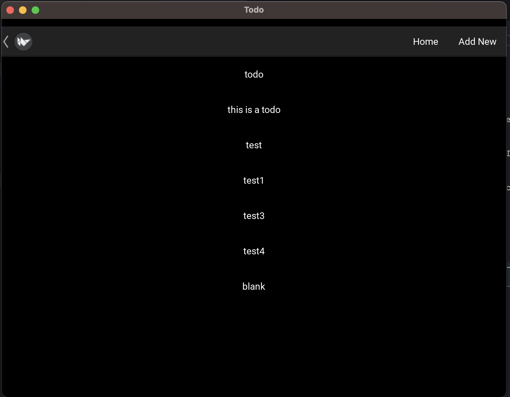
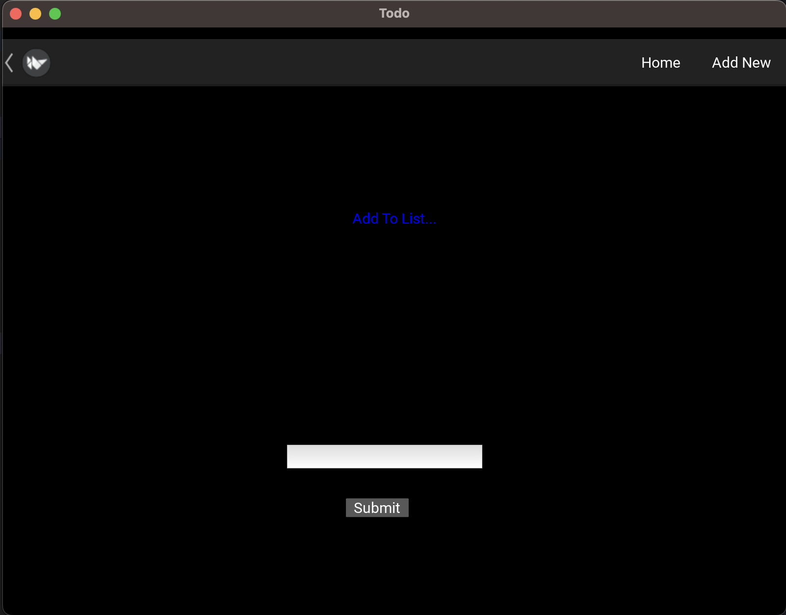

## ToDo App

The ToDo App is a simple application designed to manage and display a list of tasks or items to be completed. It allows users to add new tasks, view them in a list format, and marks them as completed.




### Functionality

#### Adding Tasks
Users can add new tasks by entering a task name and clicking the "Submit" button. This action sends a request to a backend server, storing the task's name in a database.

#### Viewing Tasks
The app retrieves tasks from the server and displays them in a list format on the main screen. It constantly updates this list to reflect any changes made to the tasks.

#### Confirmation Screen
When a task is added successfully, a confirmation screen briefly appears, displaying a message confirming the addition of the new task. It automatically navigates back to the main screen after a few seconds.

### Framework and Libraries Used

#### Frameworks
The ToDo App is built using a combination of frameworks:

- **Kivy:** [Kivy](https://kivy.org) is an open-source Python library used for developing multi-touch applications. It provides a simple way to create cross-platform applications that can run on various devices and platforms.
- **Django:** [Django](https://www.djangoproject.com/) is a high-level Python web framework known for its simplicity and robustness in building web applications. It's used in the backend of the ToDo App to handle server-side logic, database management, and API development.

#### Libraries
The app uses the following libraries:
- **Requests**: It's used to make HTTP requests to communicate with a backend server.
- **Kivy**: The main framework used for creating the user interface and managing the application's frontend logic.
- **Django Rest Framework (DRF)**: Backend framework used for building RESTful APIs to handle CRUD operations for managing tasks.

### Running the App

TO BE ADDED

### Acknowledgments

The ToDo App is created for educational purposes and demonstrates the implementation of a basic task management system using Kivy and Django Rest Framework.

---

Feel free to customize or add more information based on the specifics of your ToDo App!


# Development

## Create env

```
python3 -m venv myenv
```

## Activate your env

On Windows:
```
myenv\Scripts\activate
```
On macOS and Linux:
```
source myenv/bin/activate
```

## Install the necessary dependencies

pip install -r requirements.txt